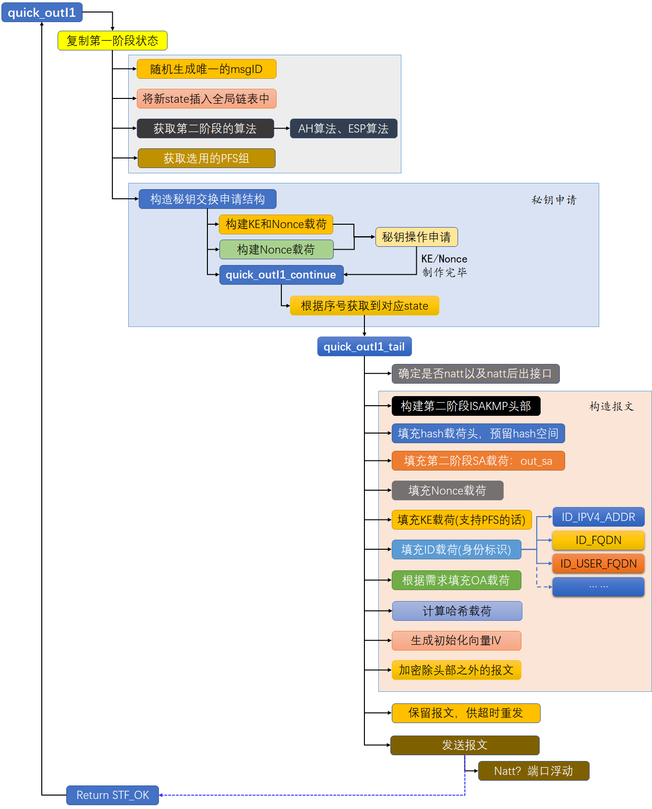
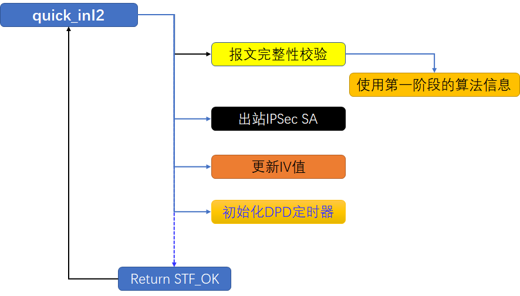

# openswan中IKE握手流程图

## 1.  CSDN专栏链接

 - [x]  [专栏序言](https://blog.csdn.net/s2603898260/article/details/105780700)

### 1.1 IPsec理论知识

 - [x] [openswan任务调度基础知识之信号](https://blog.csdn.net/s2603898260/article/details/105810406)
 - [x] [🔥 IPSec协议详细介绍.pdf (一本书)](https://download.csdn.net/download/s2603898260/85419257)
 - [x] [🔥 IPSec技术理论介绍.pdf ](https://download.csdn.net/download/s2603898260/85419242)
 - [x] [IBM手册，包括IKE协商commit位详解](https://download.csdn.net/download/s2603898260/85477689)
### 1.2 openswan环境搭建

 - [x]  [openswan框架和编译时说明](https://blog.csdn.net/s2603898260/article/details/112975141)
 - [x]  [openswan编译安装](https://blog.csdn.net/s2603898260/article/details/105855454)
### 1.3 NAT穿越

 - [x]  [NAT-T下的端口浮动](https://blog.csdn.net/s2603898260/article/details/105214411)
 - [x] [NAT-T原理和环境搭建](https://blog.csdn.net/s2603898260/article/details/105212626)
### 1.4 openswan函数笔记

- [x] [🔥IPSec交互报文下载(部分报文可wireshark解密🔱)](https://download.csdn.net/download/s2603898260/27541505)
- [x] [🔥学习过程中添加了部分注释的openswan源码🔱](https://github.com/Top-Fish/IPSecVPN.git)
- [x] [🔥Pluto源码注释PDF下载🔱](https://download.csdn.net/download/s2603898260/12279582)
- [x] [IPSec加密流程PDF下载](https://download.csdn.net/download/s2603898260/13208646)
 - [x]  [in_struct和out_struct讲解](https://blog.csdn.net/s2603898260/article/details/106172947)
 - [x] [openswan中out_sa()函数报文封装思想](https://blog.csdn.net/s2603898260/article/details/106206914)
 - [x]  [openswan发送状态分析](https://blog.csdn.net/s2603898260/article/details/106131750)
 - [x]  [pluto中监听各个网口的500端口处理逻辑](https://blog.csdn.net/s2603898260/article/details/107913541)
 - [x]  [pluto中CPU占有率高的接口与优化方案]()
 - [x] [openswan支持的算法及参数信息](https://blog.csdn.net/s2603898260/article/details/106578067)
 - [x] [openswan中ISAKMP交互过程关键函数接口](https://blog.csdn.net/s2603898260/article/details/106203601)
 - [x] [openswan中命令行解析函数：getopt_long、getopt](https://blog.csdn.net/s2603898260/article/details/113447879)
  - [x] [openwan中ipsec.conf配置文件多个保护子网解析流程](https://blog.csdn.net/s2603898260/article/details/113445039) 

### 1.5 IKEv1协商流程

 - [x] [openswan协商流程之（一）：main_outI1()](https://blog.csdn.net/s2603898260/article/details/106226299)
 - [x] [openswan协商流程之（二）：main_inI1_outR1()](https://blog.csdn.net/s2603898260/article/details/106226416)
 - [x]  [openswan协商流程之（三）：main_inR1_outI2()](https://blog.csdn.net/s2603898260/article/details/106247599) 
 - [x]  [openswan协商流程之（四）：main_inI2_outR2()](https://blog.csdn.net/s2603898260/article/details/106271199)
 - [x]  [openswan协商流程之（五）：main_inR2_outI3()](https://blog.csdn.net/s2603898260/article/details/106310714) 
 - [x] [openswan协商流程之（六）：main_inI3_outR3()](https://blog.csdn.net/s2603898260/article/details/106580396)
 - [x] [openswan协商流程之（七）：main_inR3()](https://blog.csdn.net/s2603898260/article/details/106592883)
 - [x] [openswan快速模式协商流程之（一）：quick_outI1()](https://blog.csdn.net/s2603898260/article/details/108252077)
 - [x] [openswan快速模式协商流程之（二）：quick_inI1_outR1()](https://blog.csdn.net/s2603898260/article/details/108459144)
 - [x] [openswan快速模式协商流程之（三）：quick_inR1_outI2()](https://blog.csdn.net/s2603898260/article/details/108560293)

-----
### 1.6 IKEv2协议相关

 - [x] [IKEv2国标下载](https://download.csdn.net/download/s2603898260/12596664) 
 - [x]  [IKEv2协议简介](https://blog.csdn.net/s2603898260/article/details/106915035)
 - [x]  [IKEv2协议关键知识点总结整理](https://blog.csdn.net/s2603898260/article/details/107117675)
 - [x]  [IKEv2协议协商流程: （IKE-SA-INIT 交换）第一包](https://blog.csdn.net/s2603898260/article/details/109019539)
 - [x]  [IKEv2协议协商流程: （IKE-SA-INIT 交换）第二包](https://blog.csdn.net/s2603898260/article/details/109062848)

### 1.7 加密流程

- [x] [ipsec 引流的实现方式](https://blog.csdn.net/s2603898260/article/details/106151539)
 - [x] [ipsec 加密流程（一）：ipsec策略匹配](https://blog.csdn.net/s2603898260/article/details/109929113)
 - [x] [ipsec 加密流程（二）：ipsec初始化操作](https://blog.csdn.net/s2603898260/article/details/109943878)
 - [x] [ipsec 加密流程（三）：ESP加密、AH认证处理流程](https://blog.csdn.net/s2603898260/article/details/110018251)
  - [x] [ipsec 加密流程（四）：封装状态机和发送流程](https://blog.csdn.net/s2603898260/article/details/110410067)

### 1.8 💖openswan进阶💖

 - [x] [ubantu与CentOS虚拟机之间搭建GRE隧道](https://blog.csdn.net/s2603898260/article/details/113043610)
 - [x] [🔥openswan一条隧道多保护子网配置](https://blog.csdn.net/s2603898260/article/details/113008094)
- [x] [🔥为何GRE可以封装组播报文而IPSEC却不行？](https://mp.csdn.net/mp_blog/creation/editor/113075156)
- [x] [🔥SSL/TLS 与 IPSec 对比](https://blog.csdn.net/s2603898260/article/details/120593578)
- [x] [🔥IKE 多预共享密钥问题 解决方案](https://blog.csdn.net/s2603898260/article/details/113575857)
- [x] [🔥openswan性能初步分析](https://blog.csdn.net/s2603898260/article/details/124872770)
### 1.9 图解密码学技术

 - [x] [DH算法图解+数学证明](https://blog.csdn.net/s2603898260/article/details/112341844)
 - [x] [RSA算法图解+数学证明](https://blog.csdn.net/s2603898260/article/details/122389816)
 - [x] [openswan中DH算法说明](https://blog.csdn.net/s2603898260/article/details/112503905)
 - [x] [图解密码学(一)](https://blog.csdn.net/s2603898260/article/details/112744384)

### 1.10 Linux内核IPSEC实现

## 2. IKE 主模式实现

### 2.1 第一包

### 2.2 第二包

### 2.3 第三包

### 2.4 第四包

### 2.5 第五包

### 2.6 第六包

### 2.7 第六包接收函數

## 3. 快速模式实现

### 3.1 第一包

### 3.2 第二包

### 3.3 第三包

### 3.4 第三包接收函数

## 4. 虚拟接口

### 4.1 加密流程

### 4.2 解密流程

